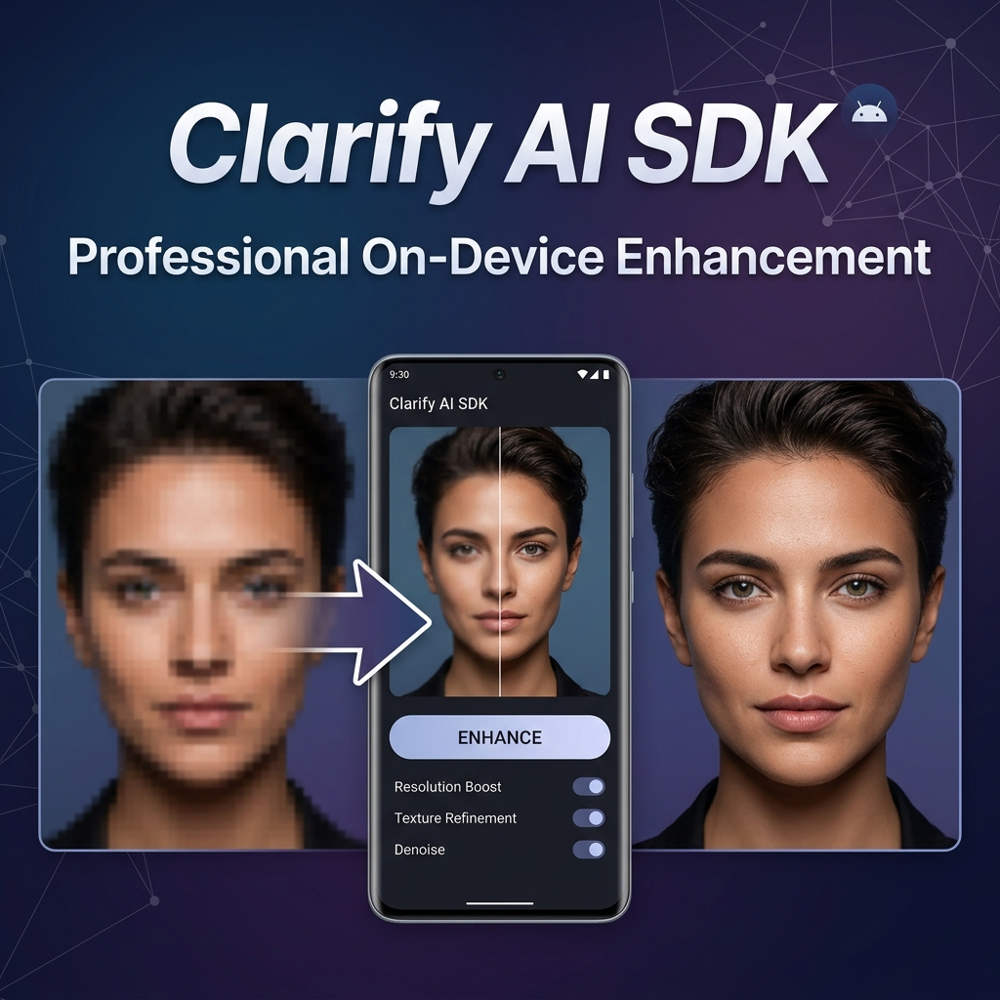

# Android Photo Enhancer SDK

<div align="center">



</div>

<div align="center">


[](https://jitpack.io/#nsenterprise9865-stack/photoenhancer-sdk-distribution)
[](https://developer.android.com)
[](#-pricing)

### The only Android SDK that enhances photos entirely on-device using GFPGAN + Real-ESRGAN.
### No server. No per-image cost. No privacy risk. Just one license key.

[💳 Get License](#-pricing) &nbsp;•&nbsp; [📖 Quick Start](#-quick-start)

</div>

---

## 💸 Stop Paying Per-Image API Costs

If you are using Replicate, Stability AI, or any cloud API to enhance photos, you are paying **$0.01–$0.05 per image**. That adds up fast:

| Monthly Active Users | Avg Enhancements | Cloud API Cost | **Photo Enhancer SDK Cost** |
|---|---|---|---|
| 1,000 users | 2/session | **$20–$100** | **$49** |
| 10,000 users | 2/session | **$200–$1,000** | **$49** |
| 100,000 users | 2/session | **$2,000–$10,000** | **$149** |

> *One license. Unlimited users. Unlimited enhancements. On the user's device.*

---

## ✨ What It Does

### 👤 Face Restoration (GFPGAN v1.4)
Restores heavily degraded, blurry, or compressed faces with studio-level clarity. Works on old scanned photos, low-resolution portrait shots, and heavily compressed images.

### 🖼 4× Super-Resolution (Real-ESRGAN)
Upscales any photo up to 4× its original resolution while recovering micro-details, skin textures, and sharpness that were never visible before.

### 🎨 Intelligent Face Blending
Advanced feathered-mask technology blends each restored face seamlessly back into the upscaled background. Users can't tell AI was involved.

### 🔒 100% On-Device Privacy
No photo ever leaves the user's device. Every pixel is processed locally using TensorFlow Lite / ONNX. Add this to your privacy policy and you're fully GDPR compliant.

---

## 🚀 Quick Start

### Step 1: Add to your project

#### **Kotlin DSL (`build.gradle.kts`)**
```kotlin
// settings.gradle.kts
repositories {
    maven { url = uri("https://jitpack.io") }
}

// app/build.gradle.kts
dependencies {
    implementation("com.github.nsenterprise9865-stack:photoenhancer-sdk-distribution:1.0.3")
}
```

### Step 2: Initialize with your license key

#### **Kotlin**
```kotlin
// In your MainActivity or Application class
lifecycleScope.launch {
    // 1. Initialize and validate the license securely
    val isLicensed = PhotoEnhancerSDK.initialize(context, "YOUR_LICENSE_KEY")
    
    // 2. Prefetch AI models in the background
    if (isLicensed) {
        PhotoEnhancerSDK.init(context)
    }
}
```

### Step 3: Show the UI

#### **Jetpack Compose**
```kotlin
// Just drop in the Compose screen anywhere in your navigation graph
PhotoEnhancerScreen(
    onBack = { 
        navController.popBackStack()
    },
    onNavigateToResult = { originalPath, enhancedPath ->
        // Navigate to your custom result screen using the saved file paths
    }
)
```

**Works with Kotlin & Compose. Zero servers. Production-ready.**

---

## 🔧 Technical Specs

| | |
|---|---|
| **Min SDK** | Android 8.0 (API 26) |
| **Architectures** | arm64-v8a, armeabi-v7a |
| **Runtime** | ONNX Runtime / LiteRT |
| **Face Detection** | Google ML Kit |
| **GFPGAN Model** | v1.4 FP16 (downloaded once) |
| **ESRGAN Model** | Real-ESRGAN (downloaded once) |
| **Avg Processing Time** | 2–5 seconds on mid-range devices |
| **Offline Support** | ✅ After first model download |

---

## 💳 Pricing

<div align="center">

| | **Indie** | **Business** |
|---|:---:|:---:|
| **Price** | **$49 / month** | **$149 / month** |
| **Apps** | 1 app | Unlimited apps |
| **Users** | Unlimited | Unlimited |
| **Processing** | Unlimited | Unlimited |
| **Email Support** | ✅ | ✅ Priority |
| **Updates** | ✅ | ✅ |
| | [**Buy Indie →**](mailto:nsenterprise9865@gmail.com?subject=Photo%20Enhancer%20SDK%20-%20Indie%20License%20Request) | [**Buy Business →**](mailto:nsenterprise9865@gmail.com?subject=Photo%20Enhancer%20SDK%20-%20Business%20License%20Request) |

</div>

---

## 🇧🇩 Payment Options (Bangladesh)

For developers in Bangladesh, you can pay via **bKash (Send Money)** at the current market exchange rate.

### 💳 Pricing in BDT
*   **Indie**: $49 × [Current Rate] ৳
*   **Business**: $149 × [Current Rate] ৳
*   *(Current Rate ~118-120 BDT/USD)*

### 📲 How to Pay via bKash:
1.  Scan the QR code below or use number: **01904891242**
2.  **Send Money** the total amount in BDT.
3.  In the **Reference**, put your **GitHub Username**.
4.  After payment, email the transaction ID to [nsenterprise9865@gmail.com](mailto:nsenterprise9865@gmail.com).

> **How to buy:** Email [nsenterprise9865@gmail.com](mailto:nsenterprise9865@gmail.com) with your plan. You will receive a payment link and your license key within **24 hours**.

---

## 🛡️ Privacy & Compliance

- ✅ **No data collection** — zero telemetry or analytics in the SDK
- ✅ **No server calls** — all AI inference runs locally on the device
- ✅ **GDPR / CCPA ready** — photos never leave the user's device
- ✅ **No internet required** after initial model download

---

## ❓ FAQ

**Q: Do I need a Firebase account?**
A: No! We handle all license validation internally. You do not need a `google-services.json` file. 

**Q: What happens if my user has no internet?**
A: The SDK caches a valid license. Users can enhance photos fully offline after the first validation and model download.

**Q: How large is the SDK itself?**
A: The SDK code is extremely lightweight. The AI models are downloaded once on first use and stored in the app's private storage to keep your initial APK size small.

**Q: Can I use this in a free app?**
A: Yes. Your users don't need to pay anything. Only you (the developer) need the license.

**Q: What if I need a refund?**
A: Contact us within 7 days of purchase if the SDK does not work as described.

---

## 📬 Contact & Support

- **Email**: [nsenterprise9865@gmail.com](mailto:nsenterprise9865@gmail.com)
- **Response time**: Within 24 hours

---

<div align="center">

**Built with ❤️ by [NS Enterprise](https://github.com/nsenterprise9865-stack)**

*Bangladesh 🇧🇩 • Powering beautiful Android apps with on-device AI*

</div>
