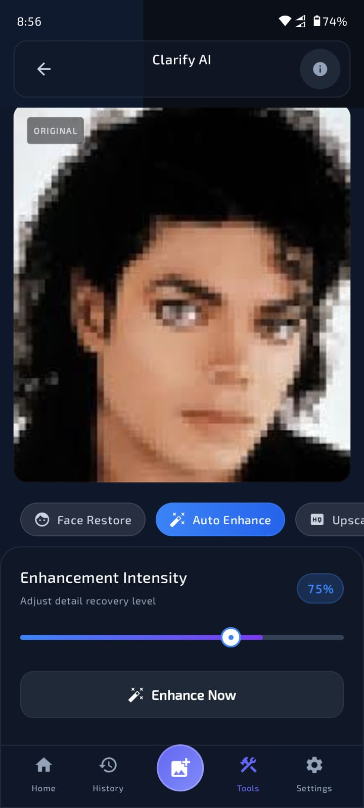
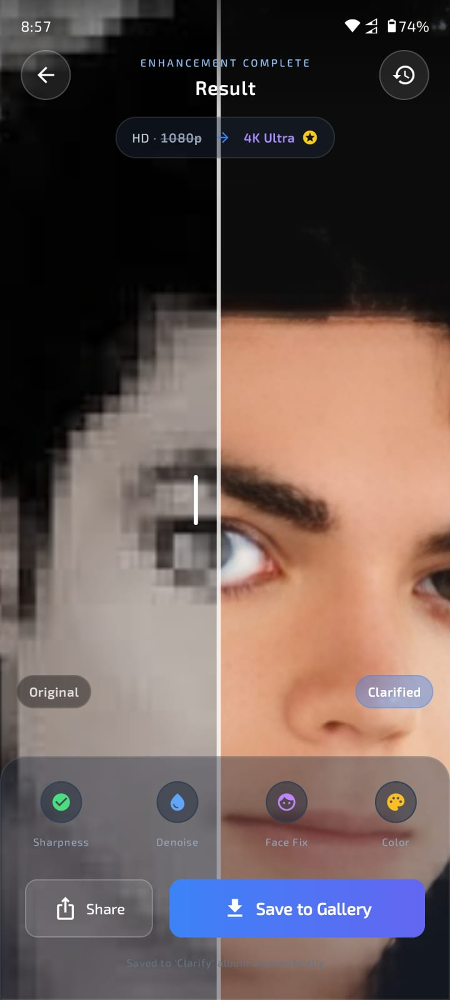

<!-- Banner -->
<div align="center">
  
</div>

<br/>

<div align="center">

[](https://github.com/nsenterprisesdk/android-photo-enhancer-sdk)
[](https://jitpack.io/#nsenterprise9865-stack/photoenhancer-sdk-distribution)
[](https://developer.android.com)
[](#-pricing--licensing)
[](https://developer.android.com/jetpack/compose)

<br/>

<h1>Clarify Photo Enhancer SDK</h1>
<h3>Professional On-Device AI Photo Enhancement — Built for Android</h3>
<p><b>No cloud. No per-image fees. 100% private. One powerful license key.</b></p>

<br/>

[**🚀 Quick Start**](#-quick-start) &nbsp;|&nbsp; [**✨ Before & After**](#-before--after) &nbsp;|&nbsp; [**🏗️ Features**](#%EF%B8%8F-core-features) &nbsp;|&nbsp; [**💳 Pricing**](#-pricing--licensing) &nbsp;|&nbsp; [**❓ FAQ**](#-faq)

</div>

---

## 💡 The Problem with Cloud AI APIs

Most photo enhancement pipelines rely on third-party cloud APIs that charge **per image**. That works at small scale — but it destroys your margins as you grow.

<div align="center">

| Monthly Active Users | Avg. Enhancements | Competitor Cloud Cost | **Clarify SDK Cost** |
|:---:|:---:|:---:|:---:|
| 1,000 users | 2 / session | ~$50 – $100 / mo | **$49 / mo** |
| 10,000 users | 2 / session | ~$500 – $1,000 / mo | **$49 / mo** |
| 100,000 users | 2 / session | ~$5,000 – $10,000 / mo | **$149 / mo** |

</div>

> **Scale infinitely.** One flat license. Unlimited users. Unlimited enhancements. All processing runs directly on the user's device — forever.

---

## ✨ Before & After

Powered by our custom **NSRestore** model and **Real-FSRCNN** upscaler — both running fully on-device in under 5 seconds.

<table align="center" style="width:100%; border-collapse:collapse;">
  <tr>
    <td align="center" width="50%">
      <b>🪄 Face Restoration — NSRestore</b><br/>
      <sub>Studio-level clarity via our ultra-lightweight 8.2 MB custom model.</sub>
    </td>
    <td align="center" width="50%">
      <b>⬆️ 4× Super-Resolution — Real-FSRCNN</b><br/>
      <sub>Lightning-fast (47 KB model) upscaling for rich background details.</sub>
    </td>
  </tr>
  <tr>
    <td align="center">
      
      
    </td>
    <td align="center">
      
      
    </td>
  </tr>
</table>

---

## 🏗️ Core Features

<table align="center" width="100%">
  <tr>
    <td width="50%" valign="top">
      <h3>👤 Intelligent Face Blending</h3>
      <p>Advanced feathered-mask technology seamlessly composites each AI-restored face back into the upscaled background — no "pasted-on" artifacts.</p>
    </td>
    <td width="50%" valign="top">
      <h3>🔒 100% On-Device Privacy</h3>
      <p>Photos never leave the device. Powered by TensorFlow Lite / ONNX. Fully GDPR & CCPA compliant — reference our processing statement directly in your privacy policy.</p>
    </td>
  </tr>
  <tr>
    <td valign="top">
      <h3>🎨 Fully Branded UI — Included</h3>
      <p>Drop in our production-ready Jetpack Compose screen and re-theme it with your colors, typography, and copy in under a minute.</p>
    </td>
    <td valign="top">
      <h3>👻 Headless Mode (Bring Your Own UI)</h3>
      <p>Need total control? Build your own camera or picker and call our invisible AI engine via a single suspending function.</p>
    </td>
  </tr>
  <tr>
    <td valign="top">
      <h3>⚡ Ultra-Lightweight Models</h3>
      <p>NSRestore (8.2 MB) + Real-FSRCNN (47 KB) = under 9 MB total. Downloaded once, cached forever. Your Play Store APK stays lean.</p>
    </td>
    <td valign="top">
      <h3>🎛️ Granular Enhancement Modes</h3>
      <p>Let users choose: AUTO_ENHANCE, UPSCALE, or RESTORE_FACE — giving them fine-grained control over the pipeline.</p>
    </td>
  </tr>
</table>

---

## 🚀 Quick Start

Integrating Clarify SDK takes **less than 10 minutes**.

### Step 1 — Add the Dependency

Add the JitPack repository to your `settings.gradle.kts`, then add the SDK to your module's `build.gradle.kts`:

```kotlin
// settings.gradle.kts
dependencyResolutionManagement {
    repositories {
        maven { url = uri("https://jitpack.io") }
    }
}
```

```kotlin
// app/build.gradle.kts
dependencies {
    implementation("com.github.nsenterprise9865-stack:photoenhancer-sdk-distribution:1.0.7")
}
```

---

### Step 2 — Initialize the SDK

Validate your license key and prefetch the AI models securely on app startup:

```kotlin
lifecycleScope.launch {
    val isLicensed = PhotoEnhancerSDK.initialize(context, "YOUR_LICENSE_KEY")
    if (isLicensed) {
        PhotoEnhancerSDK.init(context) // Prefetch & cache models (~9 MB, first run only)
    }
}
```

---

### Step 3 — Launch Enhancement (3 Options)

#### Option A — Plug & Play Compose UI *(Recommended)*

Drop our pre-built screen directly into your navigation graph:

```kotlin
PhotoEnhancerScreen(
    initialUri = userPickedUri,
    onBack = { navController.popBackStack() },
    onNavigateToResult = { originalPath, enhancedPath ->
        // Navigate to your custom result screen
    }
)
```

---

#### Option B — Brand the UI *(Custom Theming)*

Override our UI with your brand colors, fonts, and strings:

```kotlin
val myBrandTheme = SDKThemeConfig.Default.copy(
    primaryAccent = Color(0xFFFF5722),
    background    = Color(0xFF121212),
    strings = SDKThemeConfig.Default.strings.copy(
        title         = "My App Enhancer",
        buttonEnhance = "Make it HD ✦"
    )
)

PhotoEnhancerScreen(
    theme  = myBrandTheme,
    onBack = { navController.popBackStack() }
)
```

---

#### Option C — Headless API *(100% Custom UI)*

Build your own UI and pipe images directly through our AI engine:

```kotlin
// Call from an IO coroutine
val enhancedBitmap = PhotoEnhancerSDK.processImageHeadless(
    context = context,
    bitmap  = originalBitmap,
    mode    = FaceEnhancementHelper.EnhanceMode.AUTO_ENHANCE // UPSCALE | RESTORE_FACE
) { progress: Float ->
    runOnUiThread {
        progressBar.progress = (progress * 100).toInt()
        progressLabel.text   = "Enhancing… ${(progress * 100).toInt()}%"
    }
}

enhancedBitmap?.let { resultImageView.setImageBitmap(it) }
```

---

## 📱 Device & Hardware Requirements

The SDK delegates computation to the device's neural processors (NPU / GPU / DSP) for maximum performance.

<table align="center" width="100%">
  <tr>
    <td width="50%" valign="top">
      <h3>✅ Supported Configurations</h3>
      <ul>
        <li><b>OS:</b> Android 8.0 (API 26+)</li>
        <li><b>RAM:</b> Minimum <b>3 GB</b> (4 GB+ recommended)</li>
        <li><b>Architecture:</b> <code>arm64-v8a</code> (optimal) · <code>armeabi-v7a</code></li>
        <li><b>Runtime:</b> LiteRT (TFLite) / ONNX Runtime</li>
      </ul>
    </td>
    <td width="50%" valign="top">
      <h3>⚠️ Known Limitations</h3>
      <ul>
        <li><b>Android Go / &lt;2 GB RAM:</b> 4× upscaling may cause Out-of-Memory crashes. Not recommended.</li>
        <li><b>Legacy Architectures:</b> <code>x86</code> and <code>mips</code> are not supported for production use.</li>
      </ul>
    </td>
  </tr>
</table>

> **Network Note:** The first launch requires a connection to securely download the compressed AI models (~9 MB). All subsequent sessions run completely offline.

---

## 💳 Pricing & Licensing

Flat-rate commercial licenses designed to grow with your business.

<div align="center">

| | 🌱 **Indie License** | 🚀 **Business License** |
|---|:---:|:---:|
| **Best For** | Solo developers & early-stage startups | Agencies & multi-app portfolios |
| **Price** | **$49 / month** | **$149 / month** |
| **Apps Covered** | 1 app package | Unlimited apps |
| **Processing** | Unlimited on-device | Unlimited on-device |
| **Support** | Standard email | Priority + strategy calls |
| | [**Get Indie License →**](mailto:support.nsenterprise@gmail.com?subject=Indie%20License%20Request) | [**Get Business License →**](mailto:support.nsenterprise@gmail.com?subject=Business%20License%20Request) |

</div>

<br/>

### 🌍 International Purchase (Paddle — Card / PayPal)

1. Email **[support.nsenterprise@gmail.com](mailto:support.nsenterprise@gmail.com)** with your license tier.
2. Receive a secure Paddle checkout link.
3. Your License Key is delivered immediately upon payment confirmation.

---

### 🇧🇩 Bangladesh Purchase (bKash)

1. Scan the QR code or send to **`01904891242`**.
2. Transfer the BDT equivalent of your license price at the current market rate.
3. Include your **email address** in the bKash reference field.
4. Email your Transaction ID to activate instantly.

<div align="center">
  
</div>

---

## 📋 Changelog

### v1.0.7 — August 2026
- **New Model:** Replaced GFPGAN with our custom `NSRestore` (8.2 MB) for superior, artifact-free face recovery.
- **New Upscaler:** Integrated `Real-FSRCNN` (47 KB) for blazing-fast 4× background upscaling.
- **Granular Control:** Added `AUTO_ENHANCE`, `UPSCALE`, and `RESTORE_FACE` modes to give users fine-grained control.
- **Massive Size Reduction:** Previous GFPGAN (167 MB) + Real-ESRGAN (69 MB) = ~236 MB. New architecture: **under 9 MB total**, delivering superior quality at a fraction of the size.
- **Pipeline Fix:** Eliminated color distortion and "white blowout" artifacts by adopting correct YCbCr space mapping and dynamic output buffer allocation.

### v1.0.5 — June 2026
- **Fix:** Internal SDK diagnostics (license/network errors) no longer surface as visible toasts or raw error strings in the host app. All user-facing messages are now clean and localized.
- **Fix:** Adaptive icon background updated to correctly respect dark-mode theming in the sample application.

### v1.0.4 and Earlier
- Initial public releases featuring GFPGAN + Real-ESRGAN integration, headless API, and full Jetpack Compose theming support.

---

## ❓ FAQ

<details>
<summary><b>Do I need a Firebase or AWS account to use this SDK?</b></summary>
<br/>
No. The SDK manages its own internal security and model delivery pipeline. You do not need any <code>google-services.json</code>, cloud credentials, or external infrastructure.
</details>

<details>
<summary><b>What is the SDK footprint on my app's download size?</b></summary>
<br/>
The SDK binary is under 2 MB. The AI models (~8.3 MB total) are downloaded dynamically on the user's first interaction and cached in private local storage — keeping your Play Store download size small.
</details>

<details>
<summary><b>Can I use this in a free, ad-supported app?</b></summary>
<br/>
Yes. You are free to monetize your host app with ads, in-app purchases, or any other model. End users do not pay NS Enterprise — only you maintain an active developer license.
</details>

<details>
<summary><b>What happens if my license expires?</b></summary>
<br/>
The SDK will return <code>false</code> from <code>PhotoEnhancerSDK.initialize()</code>. Enhancement features will be unavailable until the license is renewed. We recommend implementing a graceful degradation flow in your app.
</details>

<details>
<summary><b>Is the SDK compatible with ProGuard / R8?</b></summary>
<br/>
Yes. The SDK ships with its own consumer ProGuard rules, which are applied automatically when minification is enabled. No manual configuration is required.
</details>

---

<div align="center">

**Built with ❤️ by [NS Enterprise](https://github.com/nsenterprise9865-stack)**

*Bangladesh 🇧🇩 · Powering beautiful Android apps with on-device AI*

[📧 Contact Us](mailto:support.nsenterprise@gmail.com) &nbsp;•&nbsp; [🐛 Report an Issue](https://github.com/nsenterprisesdk/android-photo-enhancer-sdk/issues) &nbsp;•&nbsp; [⭐ Star on GitHub](https://github.com/nsenterprisesdk/android-photo-enhancer-sdk)

<br/>

---

<sub>Made by <b>Nahidul Islam Nahid</b></sub>

</div>

